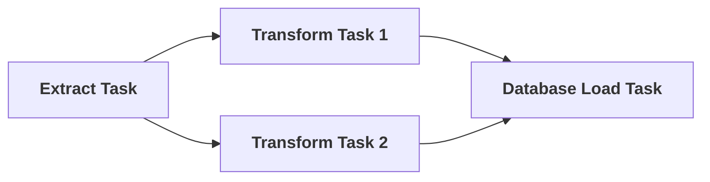
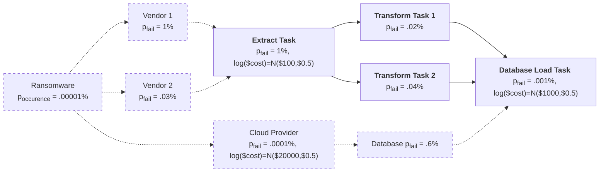
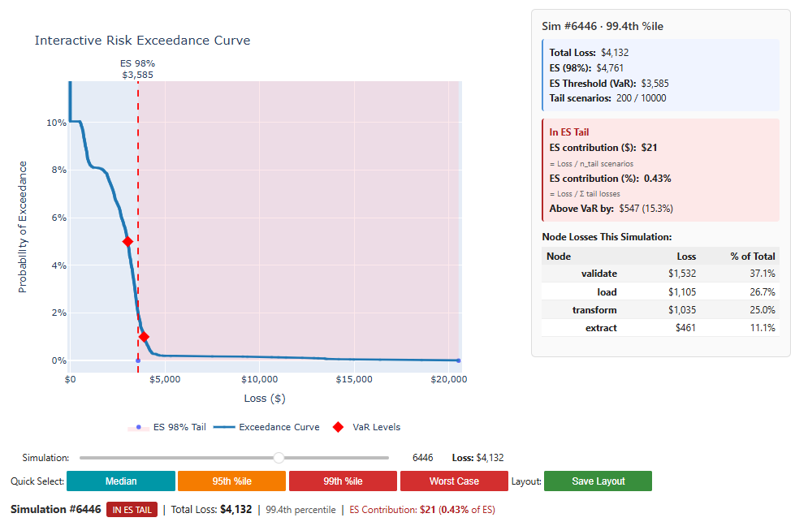
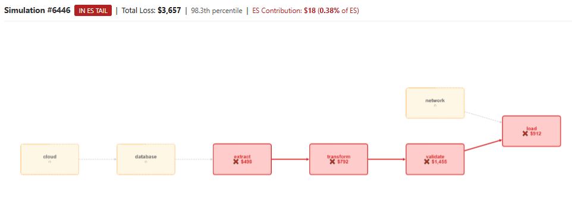
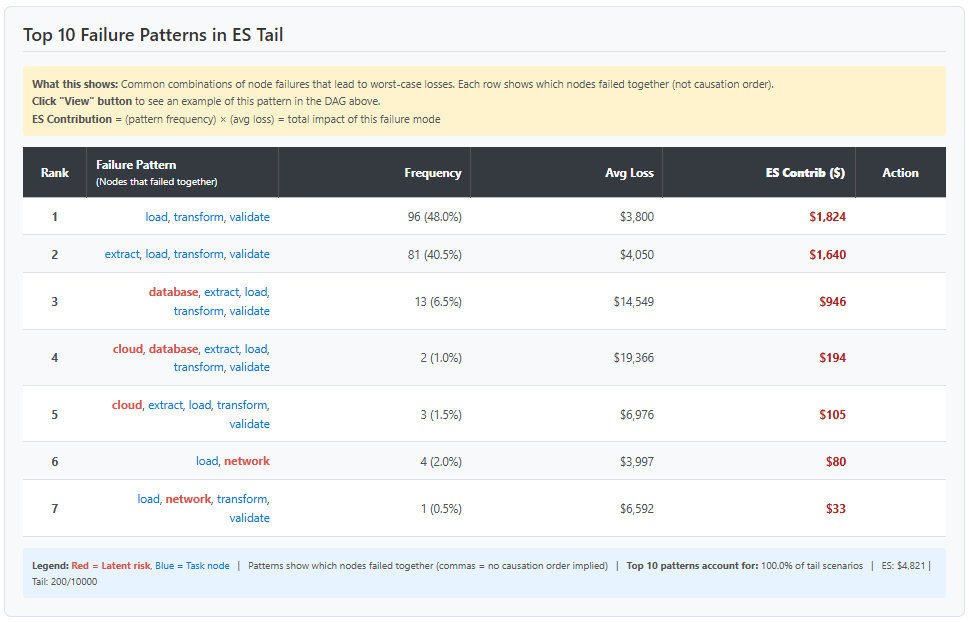
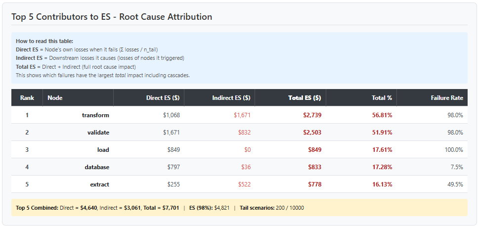

# RiskDAG

**Enterprise Risk Modeling for DAG Workflows and Risk Cascades**

RiskDAG is a Python library designed for enterprise risk managers to model, analyze, and quantify risks in existing and new data pipelines and enterprise systems. The underlying philosophy of this package is that since many complex dependencies in modern tech stacks are handled by DAGs (directed acyclic graphs) in the Apache Airflow framework, enterprise risk managers should be able to observe these crucial DAG workflows, annotate them with estimates of the probability of failure and impact costs, and then estimate business costs via stochastic simulation.

The RiskDAG package enables enterprise risk managers to import and annotate existing Airflow DAGs—such as a basic ETL workflow defined by `Extract Task >> Transform Task 1 >> Load` and `Extract Task >> Transform Task 2 >> Load`, visualized below—with risk metadata like failure probabilities and cost distributions to enhance tech stack observability.


For instance, an annotated version incorporates task-specific marginal probabilities of failure, vendor inputs, exogenous risks like cyber attacks, and infrastructure dependencies like so:



In the above, solid arrows and boxes indicate concrete tasks and hard dependencies, while dashed boxes and lines indicate latent risks and their impact on the particular DAG workflow. Marginal failure probaiblities and costs are estimated from historical Ariflow logs or by experience.


The RiskDAG package allows users to:

1) Model the probability and costs of latent risks faced by tech stacks using *the same* language used by software engineers designing crucial workflows, thereby enabling users to understand how risks and costs can cascade once triggered,
 2) Import existing Airflow DAGs used in production and annotate them with failure probabilities and cost distributions, and
 3) Link the modeling from 1) to 2) via convenient DAG-based semantics and scripting language.

## Features

- **Latent Risks**: Model systemic risks and their co-dependencies (infrastructure failures, cyber attacks, external dependencies)
- **Contagion Modeling**: Define how risks cascade and amplify using the `>>` or `@` operator, explained further below.
- **Time Scale Conversion**: Automatically convert failure probabilities between different time scales (hourly, daily, yearly).
- **Monte Carlo Simulation**: Run Monte Carlo simulations to quantify risk exposure; compute exceedance curves, VaR, Expected Shortfall, etc.
- **Interactive Visualization**: Generate exceedance curves, loss distributions, and failure rate charts
- **Airflow Integration**: Seamlessly import existing Airflow DAGs

## Installation & Access

RiskDAG is currently in private beta. 

**Interested?** Contact: ExpandThenSimplify at gmail.com

## Quick Start

### Example 1: Pure RiskDAG with deterministic cascade

```python
from riskdag import RiskNode, LatentRiskNode, RiskDAG
from scipy import stats

with RiskDAG('etl_pipeline', time_scale='hour') as dag:
    # Define latent infrastructure risks
    cloud = LatentRiskNode(
        'cloud_service', 
        p_fail=0.001,  # .1% daily 
        loss_dist=stats.norm(loc=5000, scale=1000),
        user_time_scale='day'  # Specify time scale in constructor
    )
    
    db = LatentRiskNode(
        'db_hosted_in_cloud', 
        p_fail=0.01,  # 1% daily
        loss_dist=stats.norm(loc=10000, scale=2000),
        user_time_scale='day'
    )
    
   
    # Define regular task nodes
    extract = RiskNode('extract_data', p_fail=0.01,
                       loss_dist=stats.norm(loc=500, scale=100))
    transform = RiskNode('transform_data', p_fail=0.05,
                         loss_dist=stats.norm(loc=1000, scale=200))
    load = RiskNode('load_data', p_fail=0.02,
                    loss_dist=stats.norm(loc=800, scale=150))
    
    # Build dependency graph using >> operator
    # (if extract fails, transform fails; if transform fails, load fails)
    db >> extract >> transform >> load
    cloud >> db  # cloud service failure affects database hosted in cloud

# Run Monte Carlo simulation
results = dag.run_monte_carlo(n_simulations=1000, seed=42)

# Print summary statistics
print(results.summary_statistics())

# Calculate risk metrics
print(f"95% VaR: ${results.get_quantile(0.95):,.2f}")
print(f"95% Expected Shortfall: ${results.expected_shortfall(0.95):,.2f}")
print(f"99% Expected Shortfall: ${results.expected_shortfall(0.99):,.2f}")

# Visualize results
from riskdag.visualization import plot_exceedance_curve
fig = plot_exceedance_curve(results, confidence_levels=[0.95, 0.99])
fig.show()
```

### Example 2: Pure RiskDAG with Contagion

```python
from riskdag import RiskNode, LatentRiskNode, RiskDAG
from scipy import stats

with RiskDAG('etl_pipeline', time_scale='hour') as dag:
    # Define latent infrastructure risks
    cloud = LatentRiskNode(
        'cloud_service', 
        p_fail=0.001,  # .1% daily 
        loss_dist=stats.norm(loc=5000, scale=1000),
        user_time_scale='day'  # Specify time scale in constructor
    )
    
    db = LatentRiskNode(
        'db_hosted_in_cloud', 
        p_fail=0.01,  # 1% daily
        loss_dist=stats.norm(loc=10000, scale=2000),
        user_time_scale='day'
    )
    
   
    # Define regular task nodes
    extract = RiskNode('extract_data', p_fail=0.01,
                       loss_dist=stats.norm(loc=500, scale=100))
    transform = RiskNode('transform_data', p_fail=0.05,
                         loss_dist=stats.norm(loc=1000, scale=200))
    load = RiskNode('load_data', p_fail=0.02,
                    loss_dist=stats.norm(loc=800, scale=150))
    
    # Build dependency graph using >> operator
    # (if extract fails, transform fails; if transform fails, load fails)
    db >> extract >> transform >> load
    cloud @ db | 0.6   # cloud service failure affects database hosted in cloud, and increases its failure rate to 60%

# Run Monte Carlo simulation
results = dag.run_monte_carlo(n_simulations=1000, seed=42)

# Print summary statistics
print(results.summary_statistics())

# Calculate risk metrics
print(f"95% VaR: ${results.get_quantile(0.95):,.2f}")
print(f"95% Expected Shortfall: ${results.expected_shortfall(0.95):,.2f}")
print(f"99% Expected Shortfall: ${results.expected_shortfall(0.99):,.2f}")

# Visualize results
from riskdag.visualization import plot_exceedance_curve
fig = plot_exceedance_curve(results, confidence_levels=[0.95, 0.99])
fig.show()
```

### Example 3: Import Existing Airflow DAG & Annotate with Risks

```python
from airflow import DAG
from airflow.operators.dummy import DummyOperator
from datetime import datetime
from scipy import stats

from riskdag import create_risk_dag_from_airflow

# Create a simple Airflow DAG
with DAG('etl_dag', start_date=datetime(2024, 1, 1), schedule='@hourly') as airflow_dag:
    extract = DummyOperator(task_id='extract')
    transform = DummyOperator(task_id='transform')
    load = DummyOperator(task_id='load')
    
    extract >> transform >> load

# Annotate with risk parameters
risk_annotations = {
    'extract': {
        'p_fail': 0.01,  # 1% failure probability
        'loss_dist': stats.norm(loc=500, scale=100)
    },
    'transform': {
        'p_fail': 0.05,  # 5% failure probability
        'loss_dist': stats.norm(loc=1000, scale=200)
    },
    'load': {
        'p_fail': 0.02,
        'loss_dist': stats.norm(loc=800, scale=150)
    }
}

# Convert to RiskDAG
risk_dag = create_risk_dag_from_airflow(
    airflow_dag,
    risk_annotations=risk_annotations,
    time_scale='hour'
)

# Run simulation
results = risk_dag.run_monte_carlo(n_simulations=1000)
print(results.summary_statistics())
```

### Example 4: Time Scale Conversion

```python
from riskdag import RiskNode, RiskDAG
from scipy import stats

# User specifies daily failure probability, but DAG runs hourly
node = RiskNode('daily_batch', p_fail=0.05, 
                loss_dist=stats.norm(1000, 100))

# Create hourly DAG
dag = RiskDAG('hourly_pipeline', time_scale='hour')

# Automatically converts 5% daily to ~0.21% hourly
dag.add_node(node, user_time_scale='day')
```

## Key Concepts

### Risk Nodes

**RiskNode**: Represents a task or component that can fail
- `node_id`: Unique identifier
- `p_fail`: Probability of failure
- `loss_dist`: Scipy distribution representing financial loss if failure occurs

**LatentRiskNode**: Represents systemic/environmental risks
- Infrastructure failures (cloud services)
- External dependencies (databases, APIs, third-party services)
- Cyber attacks, security breaches
- Regulatory changes, compliance issues

### Operators

**`>>` (Dependency Operator)**
```python
A >> B  # If A fails, B automatically fails (cascade)
```

**`@` (Contagion Operator)**
```python
LatentA @ LatentB | 0.6  # If LatentA triggers, LatentB has 60% chance of triggering
```

### Time Scale Conversion

RiskDAG automatically converts failure probabilities between time scales using exponential decay:

```python
# DAG runs every hour, but you have annual failure data
dag = RiskDAG('pipeline', time_scale='hour')
node = RiskNode('task', p_fail=0.10)  # 10% annual failure rate
dag.add_node(node, user_time_scale='year')  # Auto-converts to hourly
```

Supported time scales: `minute`, `hour`, `day`, `week`, `month`, `year`

**Key Feature:** Nodes automatically register with the RiskDAG instance when you use `>>` or `@` operators inside the context manager

### Risk Metrics

- **VaR (Value at Risk)**: Loss threshold at a given confidence level
- **ES (Expected Shortfall)**: Average loss beyond the VaR threshold
- **Exceedance Curve**: Probability of exceeding each loss level
- **Node Failure Rates**: Per-node failure frequencies across simulations

## Value at Risk (VaR)

**Definition:** The loss threshold at a given confidence level α.

$$\text{VaR}_\alpha = \inf\{x : P(L \leq x) \geq \alpha\}$$

Or equivalently, the α-quantile of the loss distribution:

$$\text{VaR}_\alpha = F_L^{-1}(\alpha)$$

**Example:** VaR₉₅ = $10,000 means 95% of losses are ≤ $10,000.

---

## Expected Shortfall (ES)

**Definition:** The expected loss given that the loss exceeds VaR.

$$\text{ES}_\alpha = \mathbb{E}[L \mid L \geq \text{VaR}_\alpha]$$

Or in integral form:

$$\text{ES}_\alpha = \frac{1}{1-\alpha} \int_\alpha^1 \text{VaR}_p \, dp$$

**Example:** ES₉₅ = $15,000 means the average loss in the worst 5% of cases is $15,000.

---

## Advanced Usage

### Adding Latent Risks to Existing Nodes

```python
# Infrastructure risk affects multiple tasks
cloud = LatentRiskNode('cloud', p_fail=0.005, loss_dist=stats.norm(10000, 2000))

# These tasks depend on cloud service
task1 = RiskNode('task1', p_fail=0.01, loss_dist=stats.norm(100, 20))
task2 = RiskNode('task2', p_fail=0.02, loss_dist=stats.norm(200, 40))

# Link latent risk to tasks
cloud >> task1
cloud >> task2

# If cloud service fails, both tasks automatically fail
```

### Complex Contagion Networks

```python
# Model cascading infrastructure failures
cloud = LatentRiskNode('cloud', p_fail=0.01, loss_dist=stats.norm(5000, 500))
hosted_db = LatentRiskNode('cloud_hosted_database', p_fail=0.02, loss_dist=stats.norm(3000, 300))
file_storage = LatentRiskNode('file_storage', p_fail=0.015, loss_dist=stats.norm(2000, 200))

# Contagion effects
cloud @ hosted_db | 0.7   # If cloud service fails, 70% chance hosted database fails
cloud @ file_storage | 0.5    # If cloud service fails, 50% file storage fails fails
```

### Custom Visualizations

Interactive visualizations are powered by Cytoscape.js (Franz et al., 2016). Users may select points on the exceedance curve to see the DAG failure mode realising the selected loss scenario.

```python
from riskdag.visualization import create_interactive_dashboard

results = dag.run_monte_carlo(1000)

dashboard = create_interactive_dashboard(dag, results, es_percentile=0.98)
# Display
widget = dashboard.create_dashboard()
display(widget)

```



*Interactive DAG visualization powered by cytoscape.js*




## Architecture

RiskDAG follows a clean separation of concerns:

```
Airflow DAG ──► Ingestion ──► Risk Graph  ──► Simulation ──► Results
                                    ↑
                    Latent risks + annotations
```

- **Airflow is optional**: You can build risk models without Airflow
- **Pure graph modeling**: Uses NetworkX for graph operations
- **Decoupled simulation**: Monte Carlo engine is independent of data source
- **Flexible output**: Results can be visualized, exported, or integrated into other systems

## Requirements

- Python 3.8+
- numpy >= 1.20.0
- scipy >= 1.7.0
- networkx >= 2.6.0
- apache-airflow >= 2.0.0 (optional, for Airflow integration)
- plotly >= 5.0.0 (optional, for interactive visualizations)
- matplotlib >= 3.3.0 (optional, for static plots)

## Citation

If you use RiskDAG in your research or production systems, please cite:

```bibtex
@software{riskdag2026,
  title = {RiskDAG: Enterprise Risk Modeling for Airflow DAGs},
  author = {RiskDAG Contributors},
  year = {2026},
  url = {https://github.com/ExpandThenSimplify/riskdag}
}
```

## Support

For issues, questions, or contributions, please visit:
- GitHub Issues: https://github.com/ExpandThenSimplify/riskdag/issues
- Documentation: https://github.com/ExpandThenSimplify/riskdag


## Acknowledgments
Franz, M., Lopes, C. T., Huck, G., Dong, Y., Sumer, O., & Bader, G. D. (2016). 
Cytoscape.js: a graph theory library for visualisation and analysis. 
*Bioinformatics*, 32(2), 309-311.
DOI: 10.1093/bioinformatics/btv557
